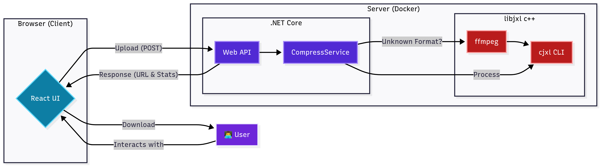

# JXL Converter Web App

A simple and powerful web tool to convert your images into the modern, efficient JPEG XL format. This application provides an easy-to-use interface to leverage the power of `libjxl` compression.

### ✨ Live Demo

You can try the application live at: **[https://alperenb.com/](https://alperenb.com/)**

---

## 🏛️ Project Architecture

This project uses a modern client-server architecture. The frontend (client) is what you see in your browser, and the backend (server) does all the heavy work. The entire server is designed to run in a **Docker** container for easy setup.

Here is a diagram that shows how everything works together:



---

## 🚀 Tech Stack & Core Logic

This project is built with two main parts:

### Frontend
* The user interface is a modern web application built with **React**. This creates a fast and responsive experience for the user.

### Backend
* The server is a powerful **ASP.NET Core Web API**. It handles file uploads and manages the compression process.
* **Compression Engine:** The API communicates with the official **`libjxl`** library through shell commands to perform the JPEG XL conversion.
* **Wide Format Support:** `libjxl` does not support all image types as direct input. To solve this, the application uses the powerful **`ffmpeg`** tool. If you upload an unsupported format (like TIFF or BMP), `ffmpeg` first converts it into a lossless PNG image. This PNG file is then used as the input for `libjxl`. This ensures high quality and support for many different file types.

---

## 📋 Features

* **Lossy & Lossless Compression:** Choose between maximum quality (lossless) or smaller file sizes (lossy).
* **Quality Control:** Adjust the quality level for lossy compression to find the perfect balance.
* **Adjustable Effort:** Use the "Effort" setting to control the compression speed versus file size.
* **Progressive Rendering:** Enable this option for a better viewing experience on the web.

---

## 🐳 How to Run Locally

You can easily run this project on your own computer using Docker.

**Prerequisites:**
* Docker
* Docker Compose

**Steps:**
1.  Clone this repository to your computer.
2.  Open a terminal in the main project folder.
3.  Run the following command:
    ```bash
    docker-compose up -d
    ```
4.  Open your web browser and go to `https://localhost:7001` to use the application.